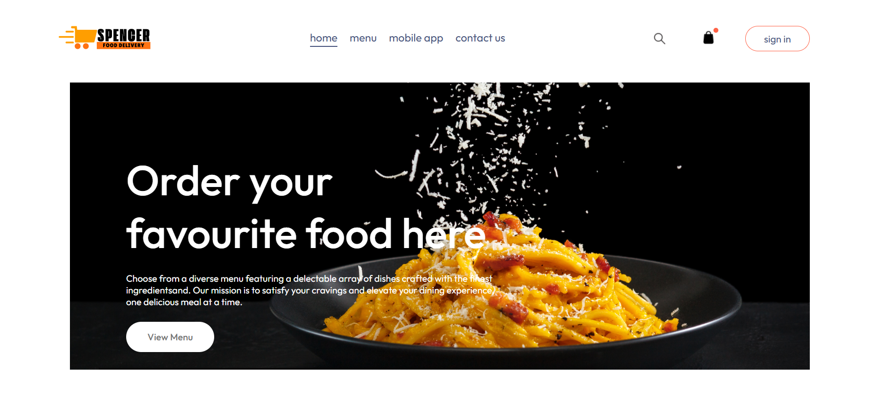
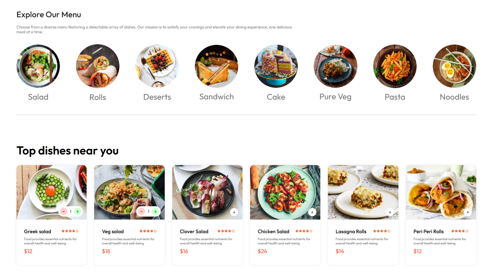
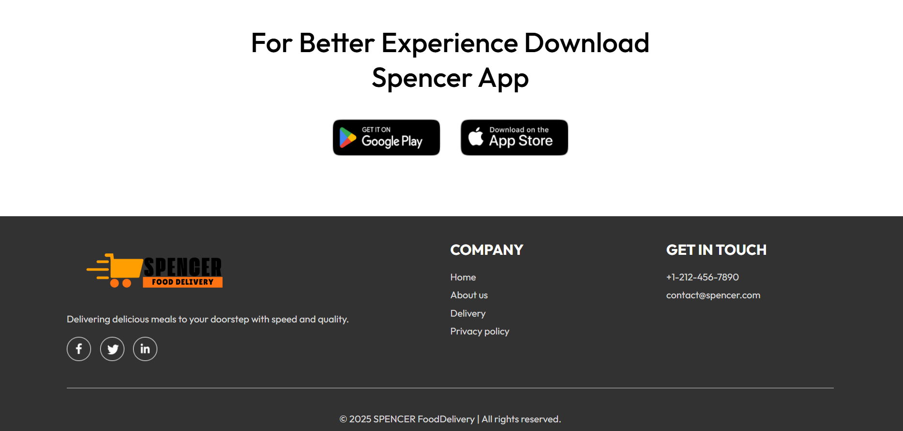
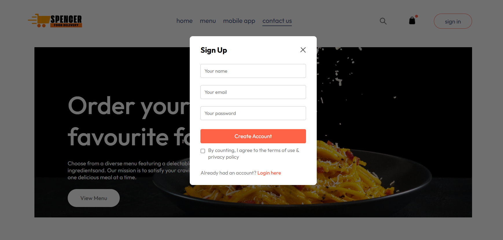
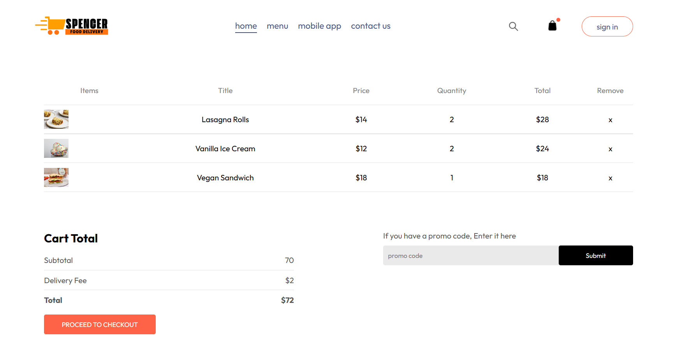
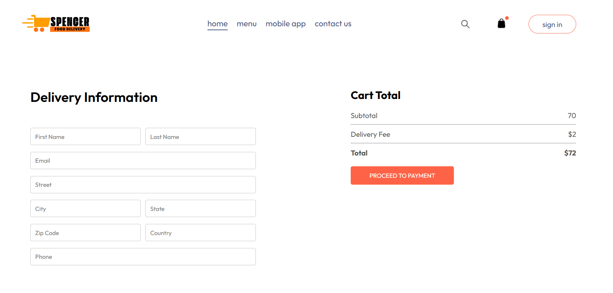

# 🍽️ *Spencer Food Delivery Web App*
<br>

A modern and responsive food delivery web application built using **React.js, JavaScript, CSS, and Vite**.

## 🚀 Features

- 🛒 Add items to the cart and update quantities
- 💰 Automatic total price calculation
- 🎨 Responsive and modern UI
- ⚡ Fast performance with Vite
- 📦 Organized code with React components

## 🛠️ Technologies Used

- **React.js** - Frontend framework
- **JavaScript** - Core functionality
- **CSS** - Styling and layout
- **Vite** - Fast build tool

## 📷 Screenshots

<table>
  <tr>
    <td></td>
    <td></td>
    <td></td>
  </tr>
  <tr>
    <td></td>
    <td></td>
    <td></td>
  </tr>
</table>

## 🎯 Getting Started

### 🏗️ Installation

1. **Clone the repository :**  
   ```bash
   git clone https://github.com/ThasuniInduma/food-delivery-app.git
   cd food-delivery-app

2. **Install dependencies :**  
   ```bash
   npm install

3. **Start the development server :**  
   ```bash
   npm run dev

4. **Start the development server :**
   Navigate to `http://localhost:5173/`

### 🍽️ Thank You for Checking Out Spencer Food Delivery! 🚀Happy coding & happy eating! 🍕🍔🥗
